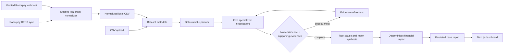
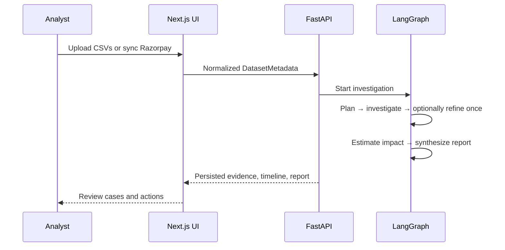
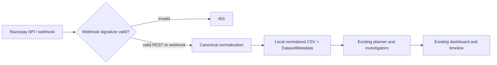

# Profit Forensics Engine

> **From payment operations to defensible financial action.**

Profit Forensics Engine is a deterministic financial-investigation workspace for operations teams. Bring in CSV files, read-only Razorpay data, or verified Razorpay webhooks; the engine identifies evidence-backed payment recovery, refund, discount, subscription, and invoice-collection opportunities—then turns them into traceable case files and a decision-ready report.

Built for the **Razorpay AI Buildathon**, it makes one principle non-negotiable: LLMs may help write narrative, but they never calculate money, confidence, routing, or anomaly detection.

## The problem

Financial operations data is fragmented. Failed payments, refunds, discounts, subscription churn, and unpaid invoices often live in separate exports or provider surfaces. That makes it hard to answer three practical questions quickly:

1. Where is revenue leaking or recoverable?
2. What evidence supports the finding?
3. What should the operations team do first?

## The solution

Profit Forensics normalizes incoming records into one investigation contract, lets a deterministic planner select only relevant investigators, and persists the resulting evidence, confidence, impact, timeline, recommendations, and executive report.

- **Bring your data:** CSV upload, Razorpay REST sync, or signed Razorpay webhook.
- **Investigate deterministically:** reusable rules, fixed routing, one bounded evidence-refinement retry.
- **Act with context:** case files link findings to records and financial impact.

## Key features

| Capability | What it delivers |
| --- | --- |
| Deterministic investigators | Payment recovery, refund leakage, discount leakage, subscription recovery, and revenue collection. |
| Evidence traceability | Every case includes source datasets, record IDs, rule outputs, confidence, and amount. |
| Financial integrity | Impact is calculated in code from normalized records—not by an LLM. |
| Razorpay-native ingestion | Read-only REST synchronization plus HMAC-verified webhooks use the same normalized data contract as CSVs. |
| Demo-ready workflow | The bundled synthetic CSV set runs every investigator in under two minutes. |
| Polished review UI | Planner scope, live completion view, case dashboard, timeline, history, and executive report. |

## Architecture



The architecture keeps DataFrames temporary and outside `CaseState`. The global retry budget is exactly one. Razorpay-specific details end at the normalization boundary; investigators are provider-agnostic.

## Investigation flow



## Razorpay integration flow



REST sync supports payments, refunds, orders, customers, subscriptions, invoices, and settlements. Webhooks validate `X-Razorpay-Signature` using the raw-body HMAC-SHA256 contract before any payload is parsed. Credentials and webhook secrets are never persisted.

## Screenshots

Screenshots are intentionally not fabricated. Add captured local images to [`docs/images/`](docs/images/) using the release-asset slots below before a public repository submission.

| Screen | Placeholder |
| --- | --- |
| Landing page | `docs/images/landing-page.png` — capture pending |
| Dataset upload and demo shortcut | `docs/images/upload-page.png` — capture pending |
| Investigation progress | `docs/images/investigation-timeline.png` — capture pending |
| Case dashboard | `docs/images/dashboard.png` — capture pending |
| Executive report | `docs/images/executive-report.png` — capture pending |
| Razorpay sync | `docs/images/razorpay-sync.png` — capture pending |

## Two-minute demo walkthrough

1. Start backend and frontend (commands below), then open `http://localhost:3000`.
2. Select **Run demo dataset**. The UI uploads the six checked-in synthetic CSVs through the normal upload API.
3. Select **Continue to investigation**, then **Launch investigation**.
4. The completion screen moves to the dashboard with planner scope, five case files, timeline, confidence, and deterministic financial impact.
5. Open **Cases**, **Timeline**, and **Executive report**. Explain that every displayed amount is calculated from the source records.
6. Optionally open **Connect Razorpay** to show Test Mode / environment credential guidance without requiring live credentials.

See [demo/JUDGING_GUIDE.md](demo/JUDGING_GUIDE.md) for ready-to-present three- and five-minute scripts.

## Local setup

Requirements: Python 3.12+ and Node.js 22+.

```powershell
# Terminal 1
cd backend
python -m venv .venv
.\.venv\Scripts\Activate.ps1
pip install -r requirements.txt
uvicorn app.main:app --reload

# Terminal 2
cd frontend
Copy-Item .env.example .env.local
npm install
npm run dev
```

Open `http://localhost:3000`. API documentation is at `http://localhost:8000/docs`; health is `GET /health`.

## Docker setup

```powershell
Copy-Item .env.example .env
docker compose up --build
```

The UI runs on `http://localhost:3000`; FastAPI runs on `http://localhost:8000`. The Compose volume retains SQLite data and uploaded evidence across container restarts. Full deployment notes are in [DEPLOYMENT.md](DEPLOYMENT.md).

# Live Deployment

Deploy the backend first, then connect Vercel to it:

1. Push this repository to GitHub.
2. In Railway, create a GitHub-backed service with `backend` as its Root Directory. Attach a Volume at `/data`, set the backend variables, deploy, and generate its public domain.
3. In Vercel, import the same repository with `frontend` as its Root Directory. Set `NEXT_PUBLIC_API_URL` to the Railway public domain (without a trailing slash), then deploy.
4. Open `https://<project>.vercel.app`, load the demo dataset, and launch an investigation. Check `https://<project>.up.railway.app/health` if the UI cannot reach the API.

The full zero-to-public-URL walkthroughs are [Railway](docs/DEPLOY_RAILWAY.md) and [Vercel](docs/DEPLOY_VERCEL.md). The production environment matrix is maintained in [DEPLOYMENT.md](DEPLOYMENT.md#production-environment-matrix).

## Environment variables

| Variable | Purpose |
| --- | --- |
| `OPENAI_API_KEY` / `OPENAI_MODEL` | Optional narrative-only root-cause, recommendation, and executive synthesis. |
| `DATABASE_URL`, `UPLOAD_DIR` | Local persistence locations. |
| `RAZORPAY_KEY_ID`, `RAZORPAY_KEY_SECRET` | Optional server-managed, read-only Razorpay REST ingestion. |
| `RAZORPAY_WEBHOOK_SECRET` | Required to receive and verify Razorpay webhooks. |
| `RAZORPAY_TIMEOUT_SECONDS` | Bounded Razorpay REST request timeout. |

Request-scoped Razorpay UI credentials are used only for the outbound connection/sync request. CSV mode does not require Razorpay credentials.

## Webhook setup and local testing

Configure a public HTTPS endpoint such as `https://your-host.example/razorpay/webhook` in Razorpay Dashboard, select the supported events, and set the same `RAZORPAY_WEBHOOK_SECRET` in the backend environment. For a local test tunnel:

```powershell
ngrok http 8000
# Register https://<tunnel-host>/razorpay/webhook in Razorpay Test Mode.
```

Supported events include payment authorized/captured/failed, refund created/processed, order paid, subscription charged/cancelled/paused, invoice paid/expired, and settlement processed. Unknown but validly signed events are logged and acknowledged safely.

## Tests and validation

```powershell
# Backend
cd backend
python -m pytest ..\tests
python -m compileall app

# Frontend
cd ..\frontend
npm run build
npm run lint
```

The suite covers rules, malformed/empty data, bounded retries, API persistence, CSV ingestion, Razorpay REST pagination/normalization, webhook signature validation, and CSV/Razorpay output equivalence.

## Folder structure

```text
backend/app/
  api/                 FastAPI upload, investigation, and Razorpay boundaries
  graph/               CaseState, planner, routers, and investigation nodes
  services/            Ingestion, provider normalization, and shared helpers
  models/              Pydantic contracts
frontend/
  app/                 Landing, upload, progress, dashboard, history, Razorpay pages
  components/          Reusable UI, timeline, report, and workflow graph
demo/                  Synthetic data and judging guide
docs/images/           Screenshot placeholders for release assets
tests/                 Deterministic, API, integration, and webhook coverage
```

## Future improvements

- Event-id idempotency and asynchronous webhook execution.
- Authenticated workspaces, retention controls, and managed persistence.
- Server-sent authoritative progress events for long-running cases.
- Versioned provider fixtures and deeper reconciliation sources.

## Buildathon notes

This is intentionally a production-inspired MVP, not an enterprise platform. SQLite, synchronous execution, local uploads, and per-webhook fresh investigations keep the submission inspectable and reproducible. The core value is preserved: deterministic financial evidence first, optional AI narrative second.
