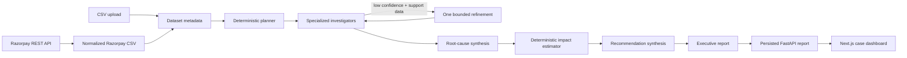
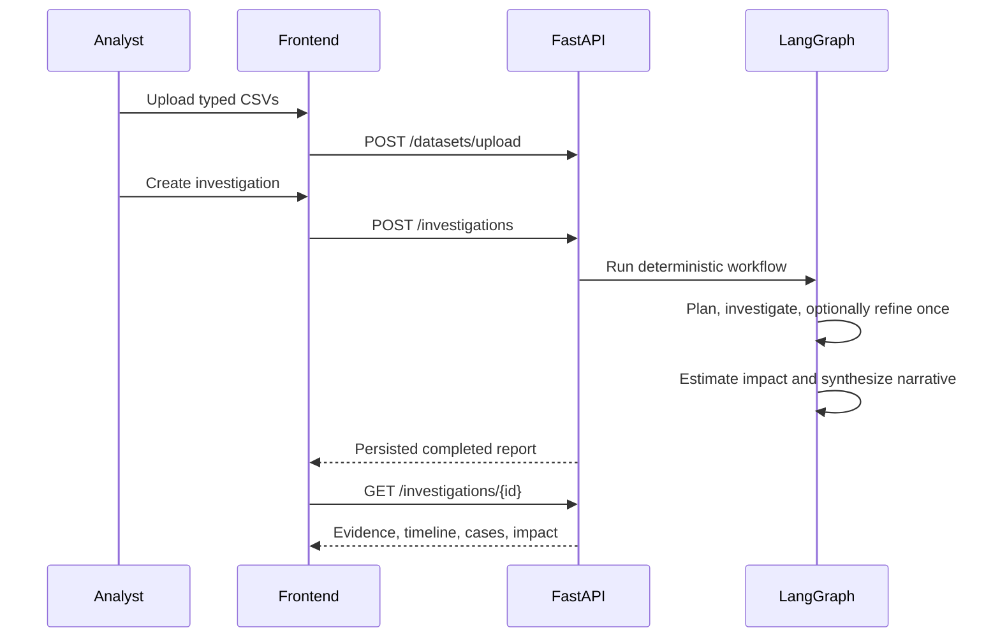

# Profit Forensics Engine

Profit Forensics Engine is a Buildathon-ready financial-investigation workspace. Upload operational CSVs or read-only Razorpay data, let a deterministic LangGraph workflow isolate supported signals, and review evidence-backed cases, financial impact, recommendations, and an executive report in one dashboard.

The engine investigates payment recovery, refunds, discount leakage, subscription recovery, and invoice collection. Routing, anomaly detection, confidence, retry decisions, and financial calculations are deterministic. LLMs are optional and limited to narrative synthesis.

## Product tour

The Next.js workspace provides a clean demo flow:

1. **Landing** — explains the deterministic workflow with a React Flow process map.
2. **CSV upload** — inspects each file and registers metadata without putting DataFrames into graph state.
3. **Case setup and progress** — shows planner selection, investigation stages, and the authoritative final timeline.
4. **Case dashboard** — presents financial impact, evidence cards, root-cause hypotheses, recommendations, and executive reporting.
5. **History** — retrieves completed persisted investigations.

The browser visual QA captures a live dashboard populated from the included synthetic data: ₹9,500 monthly and ₹1,14,000 annualized exposure across five traceable case files. Run the demo locally to view the interactive screens.

## Architecture



| Layer | Responsibility |
| --- | --- |
| `backend/app/models/schemas.py` | Validated domain and API contracts |
| `backend/app/graph/` | Typed LangGraph state, pure routers, compiled workflow |
| `backend/app/graph/nodes/` | Case management, analysis, refinement, impact, and synthesis |
| `backend/app/services/investigators/` | Shared CSV, confidence, and case-file helpers |
| `backend/app/api/` | Dataset upload and investigation APIs |
| `backend/app/services/razorpay_normalization.py` | Pure Razorpay payload normalization boundary |
| `backend/app/services/razorpay_client.py` | Bounded, read-only Razorpay REST pagination and retry client |
| `frontend/` | Next.js, TypeScript, Tailwind, shadcn-style components, and React Flow UI |

DataFrames are temporary investigator inputs and are never stored in `CaseState`. The global retry budget is exactly one. Case-file revisions merge by stable ID, preventing a refinement rerun from double-counting impact.

## Investigation workflow



## Quick start

Requirements: Python 3.12+ and Node.js 22+.

```powershell
# Terminal 1: backend
cd backend
python -m venv .venv
.\.venv\Scripts\Activate.ps1
pip install -r requirements.txt
uvicorn app.main:app --reload

# Terminal 2: frontend
cd frontend
Copy-Item .env.example .env.local
npm install
npm run dev
```

Open `http://localhost:3000`. API docs are available at `http://localhost:8000/docs`; health is `GET /health`.

For a containerized run, see [DEPLOYMENT.md](DEPLOYMENT.md):

```powershell
docker compose up --build
```

## API

| Method | Endpoint | Purpose |
| --- | --- | --- |
| `GET` | `/health` | Health check |
| `POST` | `/datasets/upload` | Upload and inspect a typed CSV |
| `GET` | `/razorpay/status` | Check environment-based Razorpay configuration |
| `POST` | `/razorpay/connect` | Validate read-only Razorpay credentials without persisting them |
| `POST` | `/razorpay/sync` | Fetch, normalize, and optionally investigate selected Razorpay resources |
| `POST` | `/investigations` | Run and persist an investigation |
| `GET` | `/investigations` | List persisted reports |
| `GET` | `/investigations/{investigation_id}` | Retrieve one report |

`dataset_type` drives planner selection. Supported type keywords include `payment`, `refund`, `discount`, `subscription`, `invoice`, and `settlement`.

## Razorpay ingestion

Open **Connect Razorpay** in the workspace, enter a read-only Razorpay Key ID and Key Secret, validate the connection, select resources, and start an investigation. The credentials are used only for the outgoing request and are never persisted. For server-managed demo credentials, set `RAZORPAY_KEY_ID` and `RAZORPAY_KEY_SECRET` in `.env` instead.

The integration fetches payments, refunds, orders, customers, subscriptions, invoices, and settlements using Razorpay collection pagination (`count`/`skip`), bounded retries for transient failures and rate limits, and response validation. It converts provider amounts from subunits exactly once, stores normalized records as local CSV inputs, and sends their ordinary `DatasetMetadata` to the unchanged planner. No investigator has provider-specific code.

## Demo

The [`demo/`](demo/) folder contains six synthetic CSVs designed to exercise every investigator. Upload them in the UI, or follow the reproducible PowerShell walkthrough in [demo/README.md](demo/README.md). The demo deliberately triggers one bounded payment-evidence refinement, then completes with five case files and a final timeline.

## Optional LLM synthesis

Set `OPENAI_API_KEY` and optionally `OPENAI_MODEL` to enable root-cause hypotheses, recommendation wording, and an executive narrative. Without credentials, the engine completes with an explicit deterministic executive-summary fallback. LLMs never calculate monetary values, confidence, routes, or retries.

## Testing and validation

```powershell
cd backend
python -m pytest ..\tests
python -m compileall app
```

The suite covers investigator rules, data validation, bounded retry behavior, API upload/execution/retrieval, Razorpay normalization, graph compilation, and a complete end-to-end lifecycle.

## Limitations

- SQLite and synchronous investigation execution are intentionally scoped for the Buildathon demo.
- Progress is shown as a client-side running-stage view while the synchronous backend works; the final displayed timeline is the graph’s authoritative persisted timeline.
- Upload storage is local filesystem storage; no authentication, tenancy, or retention policy is included.
- Razorpay synchronization is a synchronous, read-only pull intended for bounded demo-sized collections; use a scheduled incremental ingestion process for large accounts.
- Root-cause and recommendation narratives require an OpenAI key; deterministic evidence remains fully usable without one.

## Suggested post-Buildathon improvements

- Add authenticated workspaces and scoped dataset retention.
- Move execution to a job queue and stream server-side timeline events.
- Add database migrations and managed Postgres persistence.
- Add observability, audit retention, and role-based review workflows.
- Expand normalization tests against versioned provider payload fixtures.
